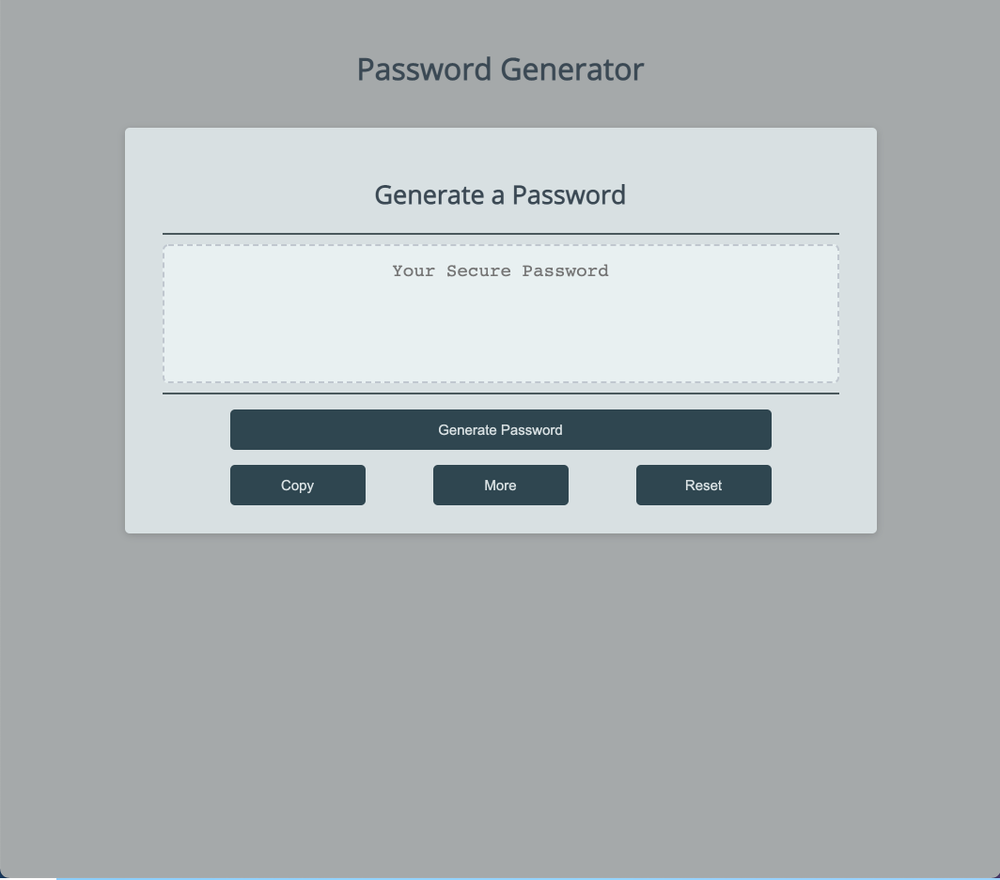
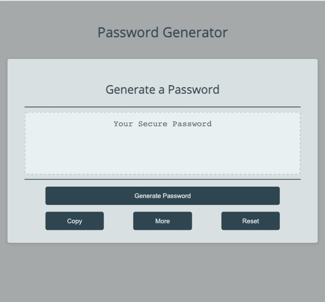
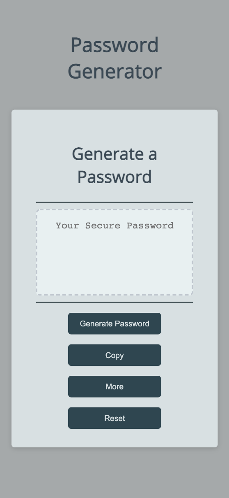

# password-generator
This project is to create an attractive and functional password generator application. Users can generate random passwords based on criteria that they’ve selected.

## Getting Started
```console
git clone https://github.com/qtian13/password-generator.git
```

## Built With
* [HTML](https://developer.mozilla.org/en-US/docs/Web/HTML)
* [CSS](https://developer.mozilla.org/en-US/docs/Web/CSS)

## Description of the Password Generator
1. There is a read only text area to display password generated and 4 functional buttons: `Generate Password` , `Copy`, `More` and `Reset`.
1. When `Generate Password` is clicked, users start to answer a series of prompted questions about their preference and a password matching the selected criteria would be generated and displayed on the page.
    * Users have to choose an integer between 8 to 128 inclusive before the next step
    * Users can select one or more characters type from: upper case alphabets, lower case alphabets, numeric characters and special characters
    * This application refers to [Password Special Characters | OWASP](https://www.owasp.org/index.php/Password_special_characters) for special characters
1. The password generated would be copied to clipboard with a click on `Copy`.
1. By clicking `More`, users will get another password with the same criteria displayed on the web.
1. Users can clear the recorded preference and the displayed password with `Reset`.
1. The user interface is screen size responsive

## Page URL
https://qtian13.github.io/password-generator/

## Page Screen Shot with Different Screen Width




## Author
Qiushuang Tian
- [Link to Portfolio Site](https://qtian13.github.io/)
- [Link to Github](https://github.com/qtian13)
- [Link to LinkedIn](https://www.linkedin.com/in/qiushuang-tian-a9754248/)

## Acknowledgments
- [Berkeley Coding Boot Camp](https://bootcamp.berkeley.edu/coding/) provided start code

